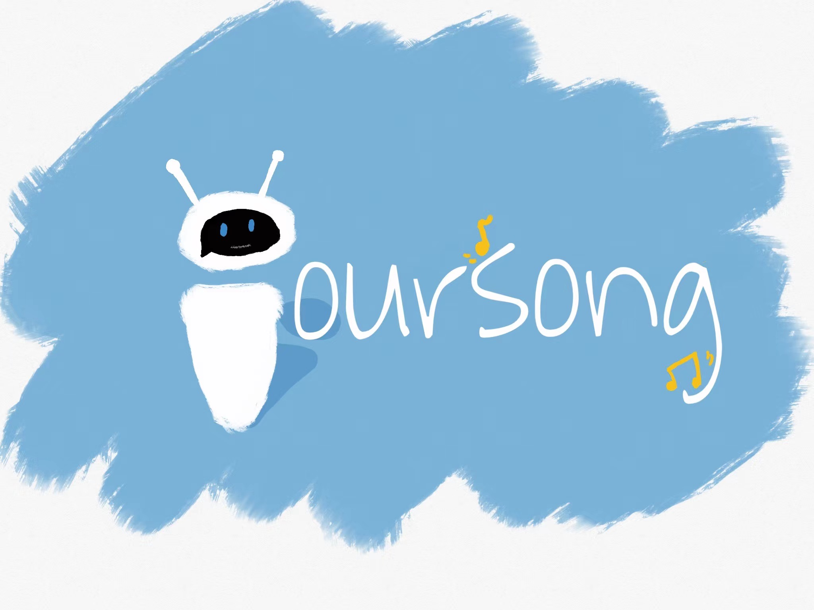

### [ Practice Module ] Project Submission Template: Github Repository & Zip File

**[ Naming Convention ]** CourseCode-StartDate-BatchCode-TeamName-ProjectName.zip

* **[ MTech Thru-Train Group Project Naming Example ]** IRS-PM-2020-01-18-IS02PT-GRP-AwsomeSG-HDB_BTO_Recommender.zip

* **[ MTech Stackable Group Project Naming Example ]** IRS-PM-2020-01-18-STK02-GRP-AwsomeSG-HDB_BTO_Recommender.zip

[Online editor for this README.md markdown file](https://pandao.github.io/editor.md/en.html "pandao")

---

### <<<<<<<<<<<<<<<<<<<< Start of Template >>>>>>>>>>>>>>>>>>>>

---

## SECTION 1 : PROJECT TITLE
## YOUR SONG - Intelligent Music Recommender Robot

---

## SECTION 2 : EXECUTIVE SUMMARY / PAPER ABSTRACT
There is no doubt that music is an indispensable spiritual companion in modern People's Daily life. Music is something that can inspire people, gives them hope, makes them believe in something greater, or lets them escape for a moment. It can be your best friend in time of need and is always there when you need it. The quote, “play the music, pause the memories, stop the pain, rewind the happiness.” This is what music can do for you in simplest terms. Music is a tool that can bind all cultures together. Every culture makes music and it is neat to see how cultures can bond over music.

It is the great desire and demand of modern people for music that leads to the emergence of a large number of music and related music apps. In this era of information explosion, the vast network resources we have access to greatly facilitate our life, so that we can listen to a variety of music at will. Whatever it’s pop, rock, folk, electronic, jazz, absolute music, rap, metal, world music, new age, classical, indie, ambient music, etc.which divided by genre. However, sometimes the more choices provided, the more difficult it is for users to find the favorite songs among the numerous songs. Many music apps have realized this and implemented intelligent personalized recommendations in order to help users discover their own interests and preferences. However, the existing recommendation function in the market is not that perfect, and the playlist acquired by users is often limited to a single style, which will form the information cocoon effect in the long run.

Our project team wanted to help music apps solve the problem of flexibility in recommendations. The intelligent recommendation robot developed by us can increase users' participation in playlist customization by allowing them to talk with the robot. After obtaining the information provided by users, our system can quickly customize different playlists in real time. This playlist customization is unlimited and can be adjusted at any time.

We used the third-party library Spotipy to scrape a large number of songs from Spotify to build a database. After obtaining a large amount of information from various dimensions of songs, we selected several song features that we thought were most suitable for subsequent data analysis: ‘Genre’, ‘Energy’, ‘Mode’, ‘Danceability’. In terms of music recommendation, we chose Item-based Collaborative Filtering Algorithm. In order to increase the diversity of our system, we combined this algorithm with informed search. In terms of the construction of the chatbot, we designed a simple and fresh chat interface that allows users to chat with the robot by vue.js. Besides, we used the python post method to resolve user preference data sent back by the front-end, and derived preference information by the rule engine, and got the music list.

Our team works very happily on this project and hopes that the project can be used and receive feedback by more uses.This project can be more international if we can cooperate with music companies and ask them to add our bots to the app as a complement to the recommendation system.

---

## SECTION 3 : CREDITS / PROJECT CONTRIBUTION

| Official Full Name  | Student ID (MTech Applicable)  | Work Items (Who Did What) | Email (Optional) |
| :------------ |:---------------:| :-----| :-----|
| Lin Qianqian | A0231438J | Recommendation engine & Engineering | e0703470@u.nus.edu |
| Liujing | A0231403Y | Recommendation engine & construction of database| e0703435@u.nus.edu |
| Yang Mingrun | A0231344R | Dialogflow research & back-end development| e0303376@u.nus.edu |
| Zhu Junkun | A0231471N | Dialogflow chatbot &  backend algorithm design | e0703503@u.nus.edu |

---

## SECTION 4 : VIDEO OF SYSTEM MODELLING & USE CASE DEMO

Please refer the videos in the folder summited to Luminus

---

## SECTION 5 : USER GUIDE

`Refer to appendix <Installation & User Guide> in project report at Github Folder: ProjectReport`

> git clone https://github.com/twinkletwinklelittlestar70/IRS-PM-2021-07-05-IS21FT-YourSon-YourSong.git

> cd SystemCode/backend

> pip install -r requirements.txt (py version 3.6)

> flask run

> **Go to URL using web browser** http://0.0.0.0:5000 or http://127.0.0.1:5000

---
## SECTION 6 : PROJECT REPORT / PAPER

`Refer to project report at Github Folder: ProjectReport`

**Recommended Sections for Project Report / Paper:**
1 EXECUTIVE SUMMARY
2 PROBLEM DESCRIPTION
2.1 PROJECT OBJECTIVE
3 KNOWLEDGE MODELING
3.1 KNOWLEDGE IDENTIFICATION
3.2 KNOWLEDGE SPECIFICATION 
3.3 KNOWLEDGE ACQUISITION
4 SOLUTION OUTLINE 
4.1 SYSTEM ARCHITECTURE
4.2 PROJECT SCOPE 
4.3 SYSTEM'S FEATURES 
4.4 FUTURE IMPROVEMENTS
Appendix 1: Project Proposal
Appendix 2: Mapped System Functionalities against the knowledge
Appendix 3: Installation and User Guide
Appendix 4: Individual Report – Lin Qianqian
Appendix 5: Individual Report – Liu Jing
Appendix 6: Individual Report – Yang Mingrun
Appendix 7: Individual Report – Zhu Junkun

---

### <<<<<<<<<<<<<<<<<<<< End of Template >>>>>>>>>>>>>>>>>>>>

---

**This [Machine Reasoning (MR)](https://www.iss.nus.edu.sg/executive-education/course/detail/machine-reasoning "Machine Reasoning") course is part of the Analytics and Intelligent Systems and Graduate Certificate in [Intelligent Reasoning Systems (IRS)](https://www.iss.nus.edu.sg/stackable-certificate-programmes/intelligent-systems "Intelligent Reasoning Systems") series offered by [NUS-ISS](https://www.iss.nus.edu.sg "Institute of Systems Science, National University of Singapore").**

**Lecturer: [GU Zhan (Sam)](https://www.iss.nus.edu.sg/about-us/staff/detail/201/GU%20Zhan "GU Zhan (Sam)")**

**zhan.gu@nus.edu.sg**
